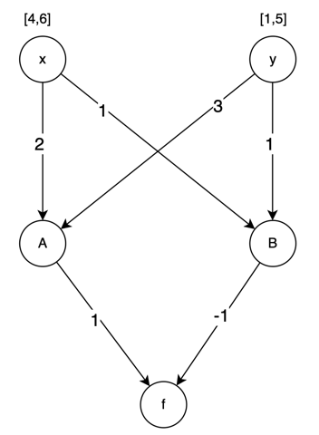

# Project

Group Name:DMSR\
Student Names: Divya Malyala (G01390473), Sai Ram Vangala (G01373045), Vinitha Puligorla (G01397891)

# Illustration

Description:<br>
The process of ReluVal is by passing the target DNN to the Symbolic constraint propagation and performing security check on the intervals, if it is safe or adversarial example, it exists from the ReluVal function by giving the result as secure or the counter example. If it is unsafe then we will proceed with the iterative refinement function, then we will be defining new intervals and passing them to symbolic constraint propagation and the process continues until we get Secure or Counter example, until it reaches the timeout <br>
<br>


**Step1:**<br>
Lets consider the below DNN example which represents an unmanned aerial vehicle.<br> 
Inputs are: distance from the intruder and intruder approaching angle <br>
Output: steering angle<br> <br>
**Assumption:**<br>
Let us assume that our goal is to confirm the safety of the predicted steering angle by examining a property that states that the steering angle should be less than 20 if the intruder's distance is in [4,6] and their potential angle of approach is in [1,5].


So lets start understanding why Symbolic interval propagation is better than Naive approach.

# Naive Interval Propagation

Input layers nodes = x,y <br>
Hidden layers nodes = A,B <br>
Output layers node = f <br>

Step1: Hidden layer 1 evaluation
```commandline
lb = lower bound
ub = upper bound
```
Lower bound and upper bounds for each node are evaluated by multiplying associated weights, and corresponding lower or upper bounds of the preceeding nodes and then summing them up <br>
If we are evaluating lower bound for a node, and if there is a negative weight associated with the preceding node, then their upper bound is multiplied with weight instead of lower bound and Vice-Versa


Here we get output interval as [0,22], which is a Safety violation<br>
Using the Naive approach is not preferable because it would not provide the tight bounds that we would need, to evaluate safety property

<br>
Step2:

# Symbolic Interval Analysis

In this approach, instead of the intervals, input nodes are considered as variables, and formula for the output nodes are evaluated by considering the weights <br>
Input interval bound values are substituted to the formula generated for the output nodes to evaluate bounds of output nodes


**Step3:**<br><br>
Property check:
In this case we get output interval as [6,16]. It was better than naive approach but does over approximation. So, we go with bisection of intervals<br>
So we are not going to consider this as safe or adversarial output, so we are proceeding with step4.<br><br>
**Step4:**
# Iterative Interval Refinement using Bisection

Iterative Interval Refinement has same process as of Naive interval propagation approach in addition with bisection<br>
An input interval is bisected into 2 parts and then for each part the output intervals are evaluated. The final output interval is calculated by performing Union operation on all the final output intervals evaluated for each part from bisection<br>
We choose the interval to bisect based on smear function, which is dependent on input range width and absolute gradient. <br>
# Example 1
Lets bisect node y as it has wider range among the input layer nodes<br>

<br>
1st iteration for the hidden layer nodes<br>

<br>
2nd iteration for the output layer node<br>

Output intervals
```commandline
[2,16] U [6,20] = [2,20]
``` 
<br>
This is safe interval. So we return this as output for ReluVal function <br>
Lets discuss another scenario with an example with iterative bisection and refinement

# Example 2

Lets bisect node y as it has wider range among the input layer nodes<br>
Bisecting the interval for node 'y'. [1,3] and [3,5].<br>

Below example shows how bisection and interval evaluation are done<br>
Intervals for Nodes A,B,f considering each bisected intervals are calculated individually<br><br>

1st Iteration for the hidden layer nodes<br>
<br>

2nd Iteration for the output layer nodes<br>
<br>

Here we still did not get safety as the output interval resulted in [-4,21] <br>

# More bisection of intervals

1st iteration for hidden layer nodes <br>
<br>
<br>
2nd iteration for output layer nodes <br>
<br>

If we perform union for the f intervals we get
```commandline
[5,18] U [3,17] U [1,15] U [-1,13] = [-1,18]
```
Which is safe. Hence we get safe intervals with ReluVal by implementing bisection


# Pseudo Code for ReluVal:

```commandline
Step 1:
    Input: Passing target DNN
Step 2:
    R(matrix),output = Calling Symbolic Interval Propagation(network)
Step 3:
    Security check for interval from the output and R matrix whether it satisfies safe/adversarial example if not passing those intervals to iterative refinement function
Step 4:
    g = Calling Backward propagation for gradient interval Inputs(network,R)
    New_interval = Influence analysis function(network, interval,g)
Step 5:
    Continue the process from step2 to step5 until we get desired output with Safe/adversarial or until it reaches timeout. 
```

# Pseudo Code for Symbolic Interval Propagation:

```commandline
Inputs:
    network: tested a neural network
    input: input interval
Variables:
    equation = (equation_upper, equation_lower) 
    R[numLayer][layerSize]: For storing cache mask matrix that will be used in backward Propagation.
    Concrete value(equation_upper,equation_lower): The result of the symbolic equation through ReLU Nodes.
Procedure SymbolicIntervalAnalysis(network, input):
    Initialize eq = (equation_upper, equation_lower)
    Initialize R[numLayer][layerSize]
Logic:
    for each layer = 1 to number_of_layers {
        Update equation = matrix multiplication equation of (weight * equation) 
        //Update output ranges for each node in the layers
        Condition on if layer is not the last_layer {
             for i = 1 to layer_size[layer] {
                Condition on if Concrete value of (equation_upper[i]) ≤ 0 {
                //Goes to next layer
                R[layer][i] = [0, 0] → Scenario: d(relu(x))/dx = [0, 0] 
                equation_upper[i] = equation_lower[i] = 0
             Condition on else if Concrete value of (equation_lower[i]) ≥ 0 {
                //Goes to next layer
                R[layer][i] = [1, 1] → Scenario: d(relu(x))/dx = [1, 1]
             Else
                R[layer][i] = [0, 1] → Scenario: d(relu(x))/dx = [0, 1]
                equation_lower[i] = 0
                // Handling ReLU activation by, if equation_upper[i]> 0, we pass the
                //upper equation on to the next layer. Otherwise, we concretize it as 
                //equation_upper(X)
                if equation_upper[i] ≤ 0
                    equation_upper[i] = concrete value of (equation_upper[i])
        else
            return R, output → Return R matrix and output


```
**Understanding the logic:**<br>
Neural network symbolic interval analysis algorithm starts with creating important variables and data structures, like the network itself, input parameters, and matrices like 'equation' and 'R'. The algorithm updates matrices with equations involving weights and intervals, enabling computations within the neural network through a loop that iterates over each layer. Every node in each layer has its conditions reviewed in order to update the output ranges ('R') according with specified requirements. One important part is Rectified Linear Unit (ReLU) activation handling, where ReLU conditions are evaluated and output range adjustments are made based on different scenarios encountered as d(relu(x))/dx =[0,0], d(relu(x))/dx =[1,1], and d(relu(x))/dx =[0,1]. The algorithm produces output, typically 'R', and calculated output bounds, determined by certain conditions reached during the process.

# Pseudo Code of Backward propagation for gradient interval Inputs:
```commandline
Inputs: 
    network: tested a neural network
    R: gradient mask
Initialize upper and lower gradient bounds
    gradient_upper = gradient_lower = weights[last_layer]
Logic:
    for each layer = number_of_layers-1 to 1 { → in reverse order
        for each i = 1 to layerSize[layer] {
            g = [gradient_upper, gradient_lower] → interval of lower and upper values
            g = hadamard_product(R[layer][i], g) → Interval of hadamard product
            g = matrix_multiplication(weights[layer], g) → Interval matrix multiplication
        }
    }
    return g

```

**Understanding the logic:** <br>
In spite of producing relatively tight boundaries for neural network output, the symbolic interval analysis approach might not generate tight enough intervals for property verification, particularly when working with large input intervals that result in multiple concretizations. In addition to the iterative interval refinement technique, two optimisation techniques are introduced to handle this problem: influence analysis and monotonicity. In the baseline iterative refinement process, input intervals are split iteratively until the output intervals satisfy the necessary security property or a timeout occurs. This process, represented as a bisection tree, continuously splits input intervals into subintervals in order to improve the output boundaries. To find adversarial cases, concrete outputs are validated against the security property. This process results in the identifying of particular sub-intervals that contain adversarial instances.
The process completed with symbolic interval analysis on these sub-intervals. The modifications also aim to reduce the average depths of bisections. Influence analysis uses gradients or Jacobians to rank which input intervals to bisect first, focusing on the input features that have the greatest impact on the output. Through the identification of the output's monotonic behavior within input intervals, monotonicity analysis allows intervals to be replaced with concrete values when the output acts monotonically within that range, thereby reducing the number of splits needed for security property checks. With complex input intervals in particular, these techniques aim to increase the efficiency and accuracy of iterative intervals improving neural network security property verification.

# Pseudo Code of Influence analysis: choose the most influential feature to split

```commandline
Inputs:
    network: tested a neural network
    input: input interval
    g: gradient interval calculated by backward propagation
Logic:
    for each i=1 to input.length {
        r = w(input[i]) → range of each input interval
        e = gup[i] * r → influence from each input to output
        if e > largest then → Check if e is greater than the largest influence
            largest = e → Update the largest influence
            splitFeature = i → Update the splitFeature
        return splitFeature → Return the most influential feature to split

```
Understanding the logic:<br>
The weight parameters that are independent of the input, fully determine the Jacobian matrix. When input is +ve, a ReLU node's gradient can be 1, and when it is -ve, it can be 0. In backward propagation, as seen in the above gradient Algorithm, we employ intervals to track and propagate the constraints on the gradients of the ReLU nodes.<br>
The estimated gradient interval is also used to calculate the smear function for an input feature. The formula Si(X) = max1≤j≤d|Jij|w(Xj) indicates that Jij - the gradient of input X j for output Yi. Over here it illustrates how we lower the over-approximation error for each refining stage by bisecting the Xj with the highest smear value.


# Evaluation
**ACAS Xu** system is composed of forty-five different neural network (NN) models. Each network consists of an input layer taking five inputs, an output layer generating five outputs, and six hidden layers with fifty neurons each. The five inputs to the NN include:

1. ρ: the distance between ownship and intruder,
2. θ: the heading direction angle of ownship relative to the intruder,
3. ψ: the heading direction angle of the intruder relative to ownship,
4. v<sub>own</sub> : the speed of ownship,
5. v<sub>int</sub>: the speed of the intruder.

The NN output includes:
COC (Clear of Conflict), Weak Left, Weak Right, Strong Left, Strong Right.

Weak left/right implies a heading change with an angle of 1.5°/s, while strong left/right indicates a more significant heading change with an angle of 3.0°/s. Each output corresponds to a score indicating the suitability of that action, with a minimal score suggesting the best action to avoid a collision. 

**MNIST** <br>
This dataset, which is a standard benchmark in machine learning for image classification tasks using the following format for the neural network<br>
**Inputs:** The network has 784 inputs, which corresponds to the number of pixels in each 28x28 image in the MNIST dataset. Each pixel is treated as an individual feature that the neural network uses to identify digits.<br>
**Outputs:** There are 10 outputs from the network, each representing one of the ten possible digits (0 through 9). The network classifies each input image as one of these digits.<br>
**Hidden Layers:** There are two hidden layers in the network, and each layer has 512 neurons. These intermediate layers are capable of extracting features and patterns from the input data, which are crucial for recognizing the different handwritten styles in the digits.<br>
**Performance:** On the MNIST test dataset, this neural network achieves an accuracy of 98.28%. This indicates that the network correctly classifies 98.28% of the handwritten digits in the test set, which is a strong performance metric for such a task.<br>


**Benchmarks used:**<br>
Common benchmarks such as MNIST and CIFAR-10 are not specifically included in the table. Rather, properties designated as Φ1 through Φ15 are listed in the paper. These attributes, which are probably unique to the networks or models under review, might stand in for particular traits or performance standards like robustness, safety, or functional correctness. Security Properties is stated as the source for some of these features, implying a connection to another study or paper. Additionally, the table splits the attributes into two categories, which can represent various sets or classifications of assessments. The 'Networks' column indicates how many networks are tested for each attribute. 


**Comparison to other tools**<br> 
**Reluplex:**<br>

<br>The time in seconds that each tool takes to evaluate the properties is shown in the columns labeled "Reluplex Time" and "ReluVal Time." The 'Speedup' column appears to be comparing ReluVal's performance to that of Reluplex, indicating the number of times faster ReluVal is. ReluVal outperforms Reluplex by almost 30 times for property Φ1, for instance. The times vary: some properties (example 4729x for Φ5) show a large speedup, while other qualities (other example: 1x for Φ2) show little to no speedup.
<br>ReluVal completes evaluations more quickly than Reluplex when verifying properties of ACAS Xu neural network models. The provided tables and text indicate that ReluVal consistently outperforms Reluplex across various security properties, achieving a significant speedup—up to 200 times faster in some cases. This performance advantage is reflected in scenarios where Reluplex times out, while ReluVal is able to terminate and provide results in a much shorter time frame. The comparison showcases ReluVal's efficiency and effectiveness in the verification of safety properties for neural networks in critical applications such as collision avoidance systems for unmanned aircraft.
<br>**The data show that ReluVal typically completes evaluations more quickly than Reluplex for the assets listed.**
<br>

**Carlini and Wagner (CW) attack**:<br>
The Carlini-Wagner (CW) attack, being a gradient-based method, relies on initial seed inputs to start the iterative process of crafting adversarial examples. The attack algorithm applies small changes to the seed inputs in the direction that increases the model's prediction error, guided by the gradients of the model's loss function with respect to the input.

<br>The "# Seeds" column indicates the number of different initial seed inputs used to begin the search for adversarial inputs.
<br>The "CW Miss" columns show how many adversarial inputs the CW attack failed to find starting from those seed inputs.
<br>With 50 seeds, CW found adversarial inputs in 24 out of 40 cases, missing 40% of them, while ReluVal found adversarial inputs in all 40 cases.
<br>With 40 seeds, CW's miss rate increased to 47.5%.
<br>With 30 seeds, CW's miss rate was 58.5%.
<br>With 20 seeds, CW missed 75% of the adversarial inputs.
<br>With 10 seeds, CW had the highest miss rate at 85%.
<br>
<br>In all scenarios, ReluVal did not miss any adversarial inputs, indicating a 0% miss rate and showcasing its effectiveness in detecting adversarial examples compared to the CW attack. This suggests that ReluVal is significantly more reliable for identifying adversarial cases in the ACAS Xu models than the gradient-based CW method, which is notably sensitive to the choice of seed inputs.
<br>Performance of the Carlini-Wagner (CW) attack against ReluVal in finding adversarial inputs across 40 adversarial properties of ACAS Xu models. A high number of misses indicates that the CW attack, starting from that specific number of seed inputs, was unable to find many of the adversarial examples that exist, highlighting the limitation of being dependent on the starting point of the attack. In contrast, ReluVal's performance is independent of seed inputs, as it does not require a starting example to begin its verification process
<br>**Hence the 0% miss rate across all scenarios.**

# Main results

ReluVal vs. Reluplex: ReluVal regularly outperforms Reluplex in the verification of safety properties, with an average speedup of up to 200x. ReluVal finishes all evaluations much faster than Reluplex, which sometimes times out and is unable to finish the assessment.
<br>ReluVal vs. Carlini-Wagner Attack: ReluVal finds a lot more adversarial examples than the Carlini-Wagner attack technique when it comes to adversarial input detection. Throughout multiple tests, ReluVal never misses an adversarial input, while the Carlini-Wagner attack frequently misses things, particularly when there are fewer seed inputs available.
<br>It mentions that a neural network that achieves 98.28% accuracy on the MNIST test dataset, which is a standalone result indicating high performance in classifying handwritten digits.
<br>
There is no direct comparison provided for other benchmarks like CIFAR-10 in the given data. The focus of the evaluation is mainly on the verification of safety properties in ACAS Xu models and the classification accuracy of a neural network on the MNIST dataset.
<br>The evaluation results, in summary, highlight ReluVal's superiority in terms of speed and thoroughness when it comes to verifying neural networks against the specified properties and benchmarks. Although no comparative data is provided for the MNIST benchmark, the neural network's reported high accuracy suggests a strong performance for this particular classification task.